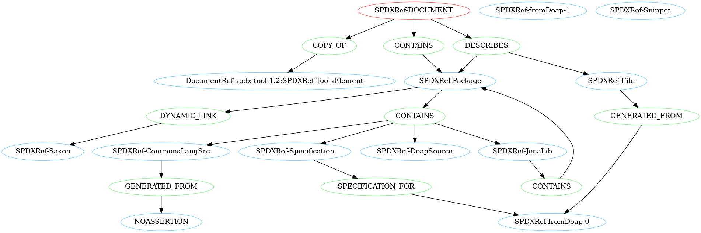

# Python library to parse, validate and create SPDX documents

CI status (Linux, macOS and Windows): [![Install and Test][1]][2]

[1]: https://github.com/spdx/tools-python/actions/workflows/install_and_test.yml/badge.svg

[2]: https://github.com/spdx/tools-python/actions/workflows/install_and_test.yml


# Breaking changes v0.7 -> v0.8

Please be aware that the upcoming 0.8 release has undergone a significant refactoring in preparation for the upcoming
SPDX v3.0 release, leading to breaking changes in the API.
Please refer to the [migration guide](https://github.com/spdx/tools-python/wiki/How-to-migrate-from-0.7-to-0.8)
to update your existing code.

The main features of v0.8 are:
- full validation of SPDX documents against the v2.2 and v2.3 specification
- support for SPDX's RDF format with all v2.3 features
- experimental support for the upcoming SPDX v3 specification. Note, however, that support is neither complete nor 
  stable at this point, as the spec is still evolving. SPDX3-related code is contained in a separate subpackage "spdx3" 
  and its use is optional. We do not recommend using it in production code yet.


# Information

This library implements SPDX parsers, convertors, validators and handlers in Python.

- Home: https://github.com/spdx/tools-python
- Issues: https://github.com/spdx/tools-python/issues
- PyPI: https://pypi.python.org/pypi/spdx-tools
- Browse the API: https://spdx.github.io/tools-python

Important updates regarding this library are shared via the SPDX tech mailing list: https://lists.spdx.org/g/Spdx-tech.


# License

[Apache-2.0](LICENSE)

# Features

* API to create and manipulate SPDX v2.2 and v2.3 documents
* Parse, convert, create and validate SPDX files
* supported formats: Tag/Value, RDF, JSON, YAML, XML
* visualize the structure of a SPDX document by creating an `AGraph`. Note: This is an optional feature and requires 
additional installation of optional dependencies

## Experimental support for SPDX 3.0
* Create v3.0 elements and payloads
* Convert v2.2/v2.3 documents to v3.0
* Serialize to JSON-LD

See [Quickstart to SPDX 3.0](#quickstart-to-spdx-30) below.  
The implementation is based on the descriptive markdown files in the repository https://github.com/spdx/spdx-3-model (latest commit: a5372a3c145dbdfc1381fc1f791c68889aafc7ff).


# Installation

As always you should work in a virtualenv (venv). You can install a local clone
of this repo with `yourenv/bin/pip install .` or install it from PyPI 
(check for the [newest release](https://pypi.org/project/spdx-tools/#history) and install it like
`yourenv/bin/pip install spdx-tools==0.8.0a2`). Note that on Windows it would be `Scripts`
instead of `bin`.

# How to use

## Command-line usage

1. **PARSING/VALIDATING** (for parsing any format):

* Use `pyspdxtools -i <filename>` where `<filename>` is the location of the file. The input format is inferred automatically from the file ending.

* If you are using a source distribution, try running:  
  `pyspdxtools -i tests/data/SPDXJSONExample-v2.3.spdx.json`

2. **CONVERTING** (for converting one format to another):

* Use `pyspdxtools -i <input_file> -o <output_file>` where `<input_file>` is the location of the file to be converted
  and `<output_file>` is the location of the output file. The input and output formats are inferred automatically from the file endings.

* If you are using a source distribution, try running:  
  `pyspdxtools -i tests/data/SPDXJSONExample-v2.3.spdx.json -o output.tag` 

* If you want to skip the validation process, provide the `--novalidation` flag, like so:  
  `pyspdxtools -i tests/data/SPDXJSONExample-v2.3.spdx.json -o output.tag --novalidation`  
  (use this with caution: note that undetected invalid documents may lead to unexpected behavior of the tool)
  
* For help use `pyspdxtools --help`

3. **GRAPH GENERATION** (optional feature)

* This feature generates a graph representing all elements in the SPDX document and their connections based on the provided
  relationships. The graph can be rendered to a picture. Below is an example for the file `tests/data/SPDXJSONExample-v2.3.spdx.json`:

* Make sure you install the optional dependencies `networkx` and `pygraphviz`. To do so run `pip install ".[graph_generation]"`.
* Use `pyspdxtools -i <input_file> --graph -o <output_file>` where `<output_file>` is an output file name with valid format for `pygraphviz` (check 
  the documentation [here](https://pygraphviz.github.io/documentation/stable/reference/agraph.html#pygraphviz.AGraph.draw)). 
* If you are using a source distribution, try running
  `pyspdxtools -i tests/data/SPDXJSONExample-v2.3.spdx.json --graph -o SPDXJSONExample-v2.3.spdx.png` to generate 
  a png with an overview of the structure of the example file.  

## Library usage
1. **DATA MODEL**
  * The `spdx_tools.spdx.model` package constitutes the internal SPDX v2.3 data model (v2.2 is simply a subset of this). All relevant classes for SPDX document creation are exposed in the `__init__.py` found [here](src%2Fspdx_tools%2Fspdx%2Fmodel%2F__init__.py).
  * SPDX objects are implemented via `@dataclass_with_properties`, a custom extension of `@dataclass`.
    * Each class starts with a list of its properties and their possible types. When no default value is provided, the property is mandatory and must be set during initialization.
    * Using the type hints, type checking is enforced when initializing a new instance or setting/getting a property on an instance
      (wrong types will raise `ConstructorTypeError` or `TypeError`, respectively). This makes it easy to catch invalid properties early and only construct valid documents.
    * Note: in-place manipulations like `list.append(item)` will circumvent the type checking (a `TypeError` will still be raised when reading `list` again). We recommend using `list = list + [item]` instead.
  * The main entry point of an SPDX document is the `Document` class from the [document.py](src%2Fspdx_tools%2Fspdx%2Fmodel%2Fdocument.py) module, which links to all other classes.
  * For license handling, the [license_expression](https://github.com/nexB/license-expression) library is used.
  * Note on `documentDescribes` and `hasFiles`: These fields will be converted to relationships in the internal data model. As they are deprecated, these fields will not be written in the output.
2. **PARSING**
  * Use `parse_file(file_name)` from the `parse_anything.py` module to parse an arbitrary file with one of the supported file endings.
  * Successful parsing will return a `Document` instance. Unsuccessful parsing will raise `SPDXParsingError` with a list of all encountered problems.
3. **VALIDATING**
  * Use `validate_full_spdx_document(document)` to validate an instance of the `Document` class.
  * This will return a list of `ValidationMessage` objects, each consisting of a String describing the invalidity and a `ValidationContext` to pinpoint the source of the validation error.
  * Validation depends on the SPDX version of the document. Note that only versions `SPDX-2.2` and `SPDX-2.3` are supported by this tool.
4. **WRITING**
  * Use `write_file(document, file_name)` from the `write_anything.py` module to write a `Document` instance to the specified file.
    The serialization format is determined from the filename ending.
  * Validation is performed per default prior to the writing process, which is cancelled if the document is invalid. You can skip the validation via `write_file(document, file_name, validate=False)`.
    Caution: Only valid documents can be serialized reliably; serialization of invalid documents is not supported.

## Example
Here are some examples of possible use cases to quickly get you started with the spdx-tools.
If you want more examples, like how to create an SPDX document from scratch, have a look [at the examples folder](examples).
```python
import logging

from license_expression import get_spdx_licensing

from spdx_tools.spdx.model import (Checksum, ChecksumAlgorithm, File, 
                                   FileType, Relationship, RelationshipType)
from spdx_tools.spdx.parser.parse_anything import parse_file
from spdx_tools.spdx.validation.document_validator import validate_full_spdx_document
from spdx_tools.spdx.writer.write_anything import write_file

# read in an SPDX document from a file
document = parse_file("spdx_document.json")

# change the document's name
document.creation_info.name = "new document name"

# define a file and a DESCRIBES relationship between the file and the document
checksum = Checksum(ChecksumAlgorithm.SHA1, "71c4025dd9897b364f3ebbb42c484ff43d00791c")

file = File(name="./fileName.py", spdx_id="SPDXRef-File", checksums=[checksum], 
            file_types=[FileType.TEXT], 
            license_concluded=get_spdx_licensing().parse("MIT and GPL-2.0"),
            license_comment="licenseComment", copyright_text="copyrightText")

relationship = Relationship("SPDXRef-DOCUMENT", RelationshipType.DESCRIBES, "SPDXRef-File")

# add the file and the relationship to the document 
# (note that we do not use "document.files.append(file)" as that would circumvent the type checking)
document.files = document.files + [file]
document.relationships = document.relationships + [relationship]

# validate the edited document and log the validation messages
# (depending on your use case, you might also want to utilize the validation_message.context)
validation_messages = validate_full_spdx_document(document)
for validation_message in validation_messages:
    logging.warning(validation_message.validation_message)

# if there are no validation messages, the document is valid 
# and we can safely serialize it without validating again
if not validation_messages:
    write_file(document, "new_spdx_document.rdf", validate=False)
```

# Quickstart to SPDX 3.0
In contrast to SPDX v2, all elements are now subclasses of the central `Element` class.
This includes packages, files, snippets, relationships, annotations, but also SBOMs, SpdxDocuments, and more.  
For serialization purposes, all Elements that are to be serialized into the same file are collected in a `Payload`.
This is just a dictionary that maps each Element's SpdxId to itself.
Use the `write_payload()` functions to serialize a payload.
There currently are two options:  
* The `spdx_tools.spdx3.writer.json_ld.json_ld_writer` module generates a JSON-LD file of the payload.
* The `spdx_tools.spdx3.writer.console.payload_writer` module prints a debug output to console. Note that this is not an official part of the SPDX specification and will probably be dropped as soon as a better standard emerges.

You can convert an SPDX v2 document to v3 via the `spdx_tools.spdx3.bump_from_spdx2.spdx_document` module.
The `bump_spdx_document()` function will return a payload containing an `SpdxDocument` Element and one Element for each package, file, snippet, relationship, or annotation contained in the v2 document.


# Dependencies

* PyYAML: https://pypi.org/project/PyYAML/ for handling YAML.
* xmltodict: https://pypi.org/project/xmltodict/ for handling XML.
* rdflib: https://pypi.python.org/pypi/rdflib/ for handling RDF.
* ply: https://pypi.org/project/ply/ for handling tag-value.
* click: https://pypi.org/project/click/ for creating the CLI interface.
* beartype: https://pypi.org/project/beartype/ for type checking.
* uritools: https://pypi.org/project/uritools/ for validation of URIs.
* license-expression: https://pypi.org/project/license-expression/ for handling SPDX license expressions.

# Support

* Submit issues, questions or feedback at https://github.com/spdx/tools-python/issues
* Join the chat at https://gitter.im/spdx-org/Lobby
* Join the discussion on https://lists.spdx.org/g/spdx-tech and
  https://spdx.dev/participate/tech/

# Contributing

Contributions are very welcome! See [CONTRIBUTING.md](./CONTRIBUTING.md) for instructions on how to contribute to the
codebase.

# History

This is the result of an initial GSoC contribution by @[ah450](https://github.com/ah450)
(or https://github.com/a-h-i) and is maintained by a community of SPDX adopters and enthusiasts.
In order to prepare for the release of SPDX v3.0, the repository has undergone a major refactoring during the time from 11/2022 to 07/2023.
